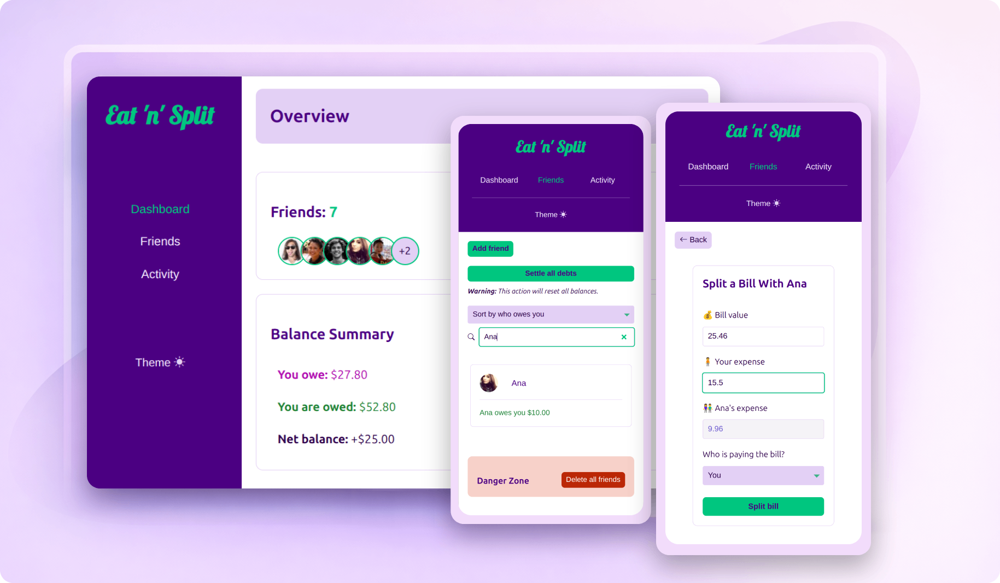
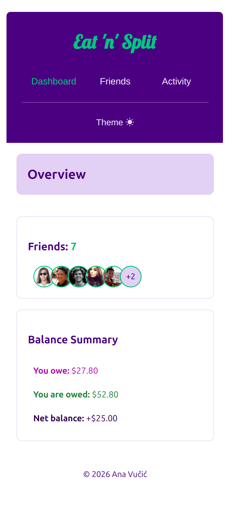
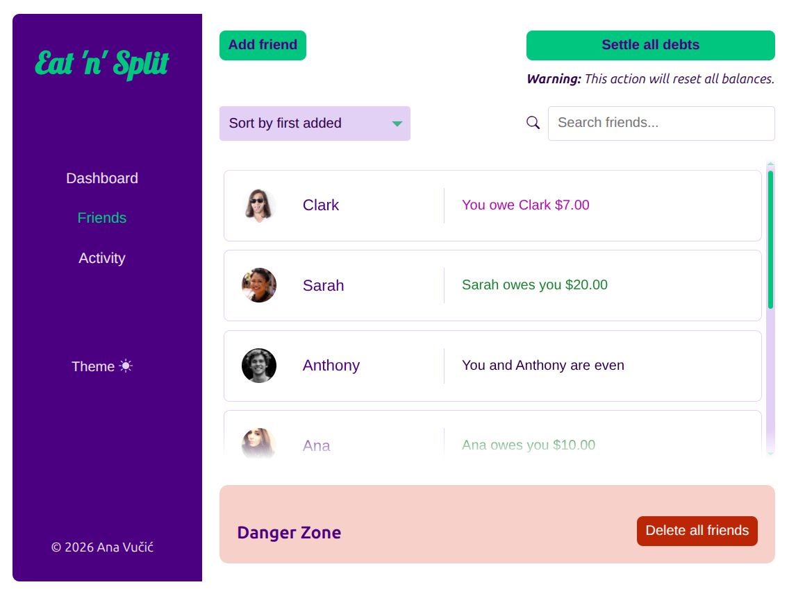
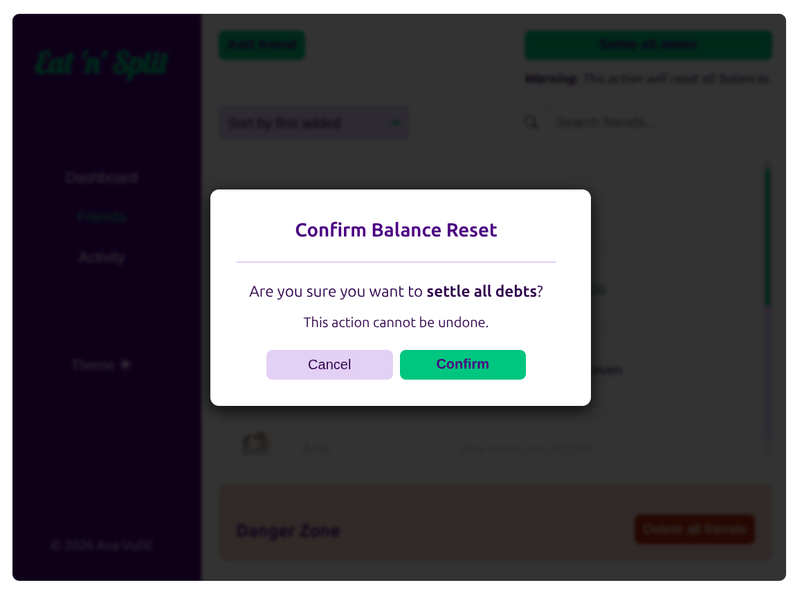
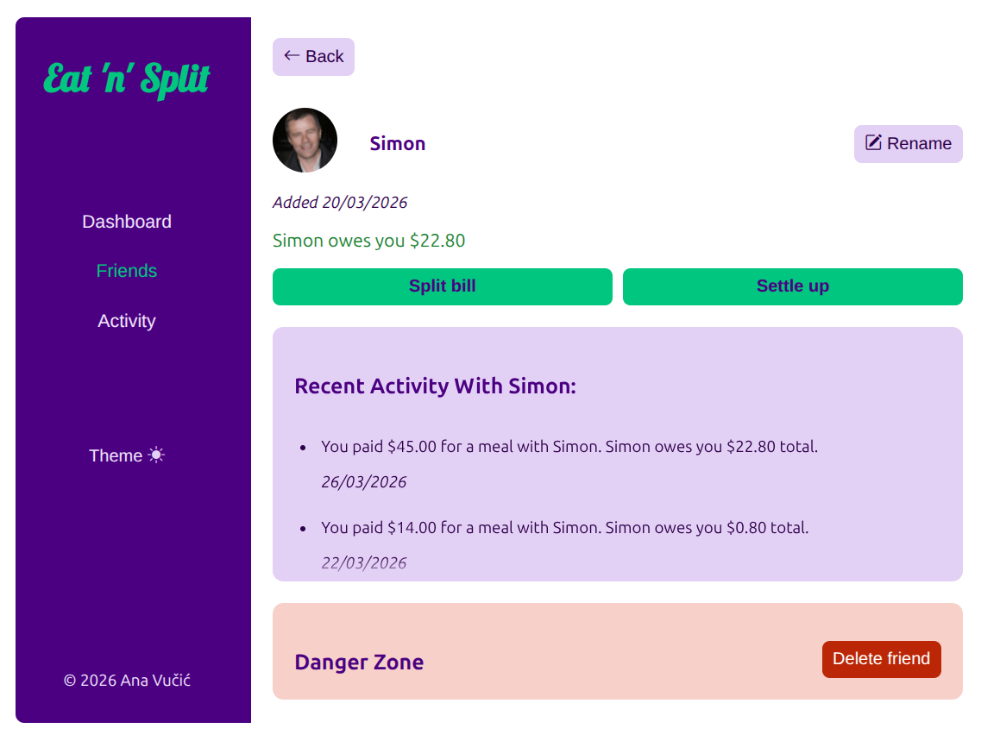
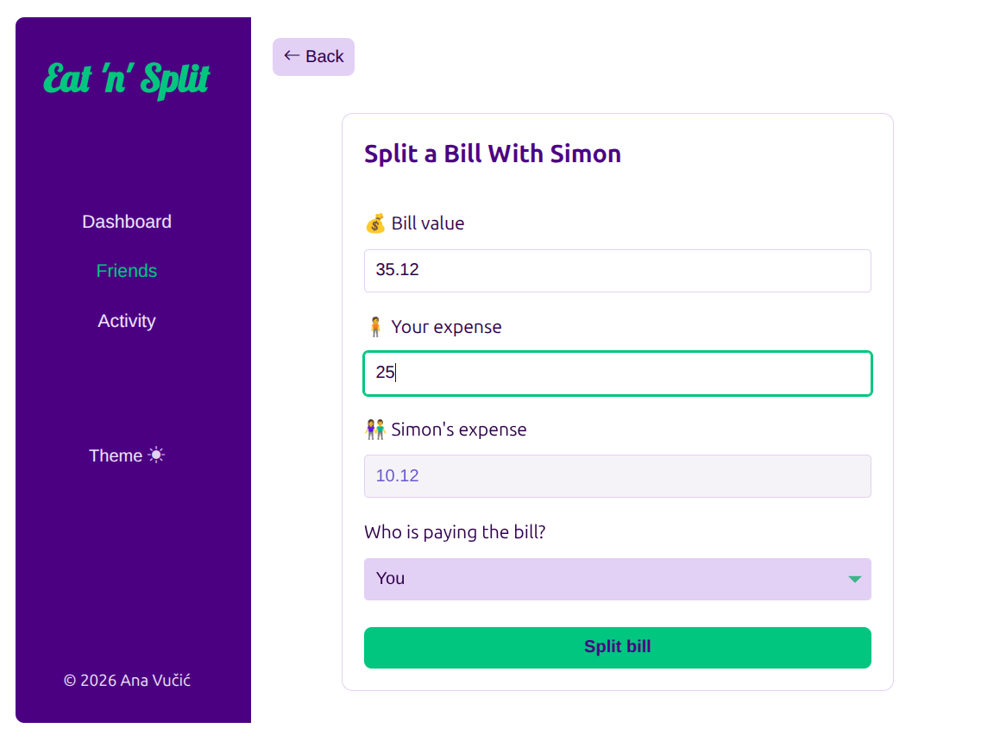
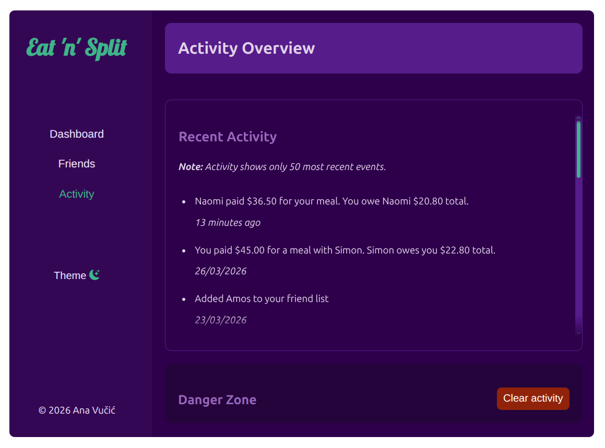

<div align="center">

#  Eat 'n' Split

**_— Expense sharing without the friction —_**

A mobile-first, keyboard-friendly, accessible **bill-splitting app** built with React.

Quickly split bills with friends, track shared expenses, settle balances, <br>
and view recent activity — all in a fast, intuitive UI.



     

</div>

## ⫶☰ Table of Contents

- [Live Demo](#-live-demo)
- [Screenshots](#-screenshots)
- [Tech Stack](#-tech-stack)
- [Features](#-features)
- [Tech Highlights](#tech-highlights)
- [Installation and Development](#-installation-and-development)
- [Project Structure](#-project-structure)
- [License](#-license)

## 🚀 Live Demo

[](https://ana-vucic-dev.github.io/eat-n-split/)

## 📸 Screenshots

<details>
  <summary><strong>View Screenshots</strong></summary>

<br>

### Dashboard (mobile)



### Friends View



### Settling Debts



### Friend Profile



### Bill Splitting



### Activity (Dark mode)



</details>

## 🧰 Tech Stack

- React 19

- Vite 7

- Context API + custom hooks

- Modular vanilla CSS

- `localStorage` persistence

- ESLint + React Hooks rules

- GitHub Pages deployment

## ✨ Features

### 💸 Smart Bill Splitting

- Enter the bill and your share — the app calculates the rest automatically.

- Choose who paid the bill to split expenses.

- View history in _Activity_ and across friend profiles.

### 👫 Friends Management

- Add friends with auto-generated, gender-based avatars.

- Rename or delete profiles.

- Search friends and filter the list.

### 📊 Activity Tracking

- Persistent history stored in `localStorage`

- App-wide and friend-related activity overviews

- Clear labels for debts and settlements

### 📱 Responsive Design

- Mobile-first UI with touch-friendly controls

- Adaptive layout with a sidebar on tablet and desktop screens

### 🌗 Light & Dark Mode

- Full theme support with CSS variables

- Custom color system with consistent contrast

- `☀️` / `🌙` mode toggle

- Persistent theme based on system settings or user preferences

<a id="tech-highlights"></a>

## 🛠️ Tech Highlights

A breakdown of the architecture, patterns, and tooling for building the app.

### ⚛️ React Architecture

- **Context API** for global state management

- **Custom hooks** for separation of concerns

- **Reducer-style controller logic** for predictable, centralized updates

- Fully functional, self-contained **views** for _Dashboard_, _Friends_, and _Activity_

### 💾 State & Persistence

- Local state for controlled forms and transient UI states

- **Persistent storage** using a custom hook

- Automatic syncing of friends, activity history, and balances across sessions

- Stateless utility modules for input validation, sanitization, and formatting

### 🤝 Accessibility (A11y)

- Semantic markup (fieldsets, legends, ARIA attributes)

- ARIA-compliant forms with:
  - `aria-invalid`, `aria-describedby`, `aria-errormessage`

  - keyboard focus management with `ref`s

  - user-friendly validation messages

- **Live region announcements** for screen-reader feedback

- Accessible dialogs:
  - keyboard focus trapping

  - ESC closing

  - backdrop transitions

  - reduced-motion support

- Full **keyboard navigation**: tabs, select, submit, cancel

- Accessible, reusable custom components (`<Button>`, `<ConfirmationDialog>`)

### 🎨 UI Styling

- Subtle shake animation for invalid form fields

- Custom `<select>` arrow

- Custom search input cancel button

- Responsive forms

- CSS Flexbox & Grid layouts

### 🔁 Reusability & Code Quality

- Dedicated `utils/` directory for:
  - Input validation

  - Input sanitization

  - Locale number, date, time, and currency formatting

  - Balance calculation

  - Activity recording

  - Fetching auto-generated avatars using the [Random User Generator API](https://randomuser.me/)

  - Sorting utilities

- Reusable button variants: `primary`, `secondary`, `danger`

- Reusable components for friend list items, tabs, modals, and form sections

- Clear separation of concerns across:
  - `components/`

  - `config/`

  - `context/`

  - `hooks/`

  - `reducers/`

  - `utils/`

  - `styles/`

### ⚡️ Performance & UX

- Debounced search input

- Efficient list re-renders (keyed list + pure UI components)

- Stable IDs generated via `crypto.randomUUID()`

- Smart expansion logic for friend profiles

- Optimized images with avatar generation based on gender

### 🔧 Tooling

- **Vite 7** for fast dev server + optimized production build

- **ESLint** with React + React Hooks rules

- **React 19** + hooks-only architecture

- **GitHub Pages** deployment via `gh-pages`

## 🧩 Installation and Development

> [!IMPORTANT]
> **Prerequisites:**
>
> - Node.js ≥ 18
> - npm ≥ 9

### 🖥️ Local Setup

```bash
git clone https://github.com/ana-vucic-dev/eat-n-split.git
cd eat-n-split
npm install
npm run dev
```

### ⚙️ Production Build

```bash
npm run build
```

### 🔍 Build Preview

```bash
npm run preview
```

## 📂 Project Structure

```text
/
├── public/
│   ├── favicon/
│   └── screenshots/
├── src/
│   ├── components/     # Reusable UI components
│   ├── config/         # Static config (navigation tabs)
│   ├── context/        # Global state providers (Friends, Theme, Dialog)
│   ├── hooks/          # Custom hooks reused across views/UI logic
│   ├── layouts/        # App-level layout components (sidebar, main, footer, dialog)
│   ├── reducers/       # Reducers for complex state updates
│   ├── styles/         # Modular CSS files split by feature/concern
│   ├── utils/          # Pure helpers (formatting, validation, calculations)
│   ├── views/          # High-level route-like views (Dashboard, Friends, Activity)
│   ├── App.jsx         # Wraps layout in global providers
│   └── main.jsx        # React entry point + top-level providers
├── index.html          # Vite entry file
├── .gitignore
├── package.json
├── vite.config.js
├── eslint.config.js
├── README.md
└── LICENSE
```

## 📄 License

This project is licensed under the [MIT License](LICENSE).
